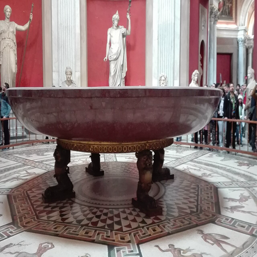

# 意大利随身导游

<p align="center">
  
</p>

<p align="center">
  一款面向中文旅行者的意大利著名景点深度导览 PWA。
</p>

<p align="center">
  <a href="https://vatican-guide.pages.dev/"><strong>在线体验</strong></a>
  ·
  <a href="#参与贡献"><strong>参与贡献</strong></a>
</p>

## 为什么做这个项目

在意大利旅行，中文导游往往价格不低，临时寻找靠谱讲解也不容易。没有讲解时，很多世界级作品和遗址最后只剩下“看过、拍过”，却不知道该看哪里，也不明白它为什么重要。

所以我自己开发了这个随身导游 App：把著名景点的参观顺序、现场定位、精华讲解和深度背景放进手机里。它不能替代真正优秀的专业导游，但能让自由行游客用更低的成本看懂景点，而不只是匆匆打卡。

项目已经公开，欢迎大家继续补充景点、校正内容、优化交互，让它逐步成为一份由旅行者共同维护的中文意大利导览。

## 在线体验

访问：**https://vatican-guide.pages.dev/**

无需注册或安装。用手机浏览器打开即可使用，也可以把它添加到主屏幕，作为独立 App 运行。

## 已收录内容

| 导览 | 分区 | 讲解点 | 内容示例 |
| --- | ---: | ---: | --- |
| 梵蒂冈博物馆 | 7 | 22 | 拉奥孔群像、拉斐尔房间、西斯廷礼拜堂、绘画馆、圣彼得大教堂 |
| 庞贝古城 | 2 | 7 | 市政广场、阿波罗圣区、斯塔比亚浴场、牧神之家、神秘别墅 |
| 罗马斗兽场 | 2 | 6 | 外立面、看台、竞技场、地下层、比赛日与遗址保护 |
| **合计** | **11** | **35** | 持续扩充中 |

## 核心功能

- **推荐参观顺序**：先建立空间感，再按动线深入，减少现场来回找路。
- **“往哪看”提示**：告诉你站在哪里、抬头还是低头、应该寻找哪个细节。
- **精华讲解**：适合边走边听的中文短讲，点击按钮后由设备的中文系统语音朗读。
- **深度解读**：补充历史背景、艺术线索、争议点和常见误解。
- **多景点切换**：在一个页面内切换梵蒂冈、庞贝和罗马斗兽场。
- **弱网与离线缓存**：出发前可缓存当前导览的页面和图片，降低景区网络不稳定的影响。
- **PWA 支持**：可以添加到手机主屏幕，获得更接近原生 App 的使用体验。
- **移动端优先**：单手操作、大按钮、底部导航，适合真实参观场景。
- **资料来源可追溯**：每个导览底部提供官方资料或可信来源链接。

## 使用方法

### 直接使用

1. 用手机打开 [在线版](https://vatican-guide.pages.dev/)。
2. 选择要参观的景点。
3. 按“推荐参观顺序”进入对应分区。
4. 先看“往哪看”完成现场定位，再点击“听精华讲解”。
5. 时间充裕时展开“深度解读”。
6. 出发前点击“一键缓存当前导览”，弱网环境下使用会更稳定。

> 景点开放区域、预约时段、单行线和票种可能临时变化，请始终以景区当天公告和官方票务页面为准。

### 添加到主屏幕

**iPhone / iPad（Safari）**

1. 点击浏览器底部的“分享”。
2. 选择“添加到主屏幕”。
3. 从主屏幕打开“意大利导览”。

**Android（Chrome）**

1. 点击右上角菜单。
2. 选择“安装应用”或“添加到主屏幕”。
3. 按提示完成安装。

## 本地运行

这是一个没有构建步骤的静态项目，只需要任意静态文件服务器。

```bash
git clone https://github.com/zhutyler21/vatican-guide.git
cd vatican-guide
python3 -m http.server 8000
```

浏览器访问：

```text
http://localhost:8000
```

不建议直接双击 `index.html`，因为浏览器对 Service Worker 和本地文件请求有限制。

## 技术实现

- 原生 HTML、CSS、JavaScript
- `data.js` 维护景点、分区、讲解点和来源数据
- Web Speech API 调用设备自带的中文语音
- Service Worker 提供核心文件和图片缓存
- Web App Manifest 提供 PWA 安装能力
- Cloudflare Pages 托管在线版本
- 无框架、无数据库、无账号系统、无后端依赖

## 项目结构

```text
.
├── index.html                 # 页面结构、样式与交互
├── data.js                    # 全部导览数据
├── sw.js                      # Service Worker 与离线缓存
├── manifest.json              # PWA 配置
├── icon.png                   # 应用图标
├── images/                    # 景点图片
├── audio/                     # 静音隐私占位文件，不是讲解音频
├── fetch_commons_images.py    # Wikimedia Commons 图片获取辅助脚本
├── _headers                   # Cloudflare Pages 缓存响应头
├── CHINA_ACCELERATION.md      # 中国大陆网络与部署说明
└── README.md
```

## 如何新增一个讲解点

核心数据位于 `data.js`。每个导览由若干 `halls` 组成，每个分区包含若干 `works`：

```js
{
  id: 'example_place',
  title: '讲解点名称',
  artist: '年代、作者或类型',
  look: '告诉游客站在哪里、应该看什么',
  script: '适合现场收听的精华讲解',
  detail: '历史背景、观看线索、争议与延伸知识'
}
```

新增内容时：

1. 在 `data.js` 中加入分区或讲解点。
2. 把对应图片放入 `images/`，文件名与 `id` 一致；也可以使用 `image` 字段指定其他文件名。
3. 在导览的 `sources` 中补充官方资料或可信来源。
4. 本地启动静态服务器，检查图片、导航、文字展开、语音朗读和离线缓存。
5. 提交 Pull Request，并说明资料来源和现场动线依据。

## 内容标准

为了让导览真正能在现场使用，贡献内容请尽量遵循这些原则：

- **先告诉游客看哪里，再讲知识。**
- **区分事实、学界争议和流行说法。** 不把未经证实的故事写成定论。
- **优先引用官方景区、博物馆、考古公园和可靠研究资料。**
- **讲解要适合中文听众。** 少堆术语，重要概念要解释清楚。
- **尊重现场规则。** 不鼓励闯入封闭区域、触摸文物、违规拍摄或大声外放。
- **不提交个人信息。** 包括私人联系方式、本机绝对路径、真人语音样本、未经授权的声音克隆产物和其他可识别个人的数据。

## 参与贡献

欢迎以下类型的贡献：

- 新增意大利城市、博物馆、教堂、遗址和经典路线
- 校正史实、年代、译名、现场位置和参观动线
- 补充官方来源、图片出处和素材授权信息
- 优化手机端交互、无障碍体验、离线能力和加载速度
- 修复错别字、失效链接、图片错误和浏览器兼容问题
- 提供真实参观后的路线反馈

推荐流程：

```bash
# Fork 仓库后

git checkout -b feature/add-new-place
# 完成修改并本地验证
git add .
git commit -m "feat: 新增某景点中文导览"
git push origin feature/add-new-place
```

然后在 GitHub 发起 Pull Request。较大的内容扩充建议先开 Issue，说明准备新增的地点、资料来源和内容范围，避免重复劳动。

## 隐私与安全

本仓库只保留公开导览所需的代码、文字和图片，不应包含私人联系方式、本机路径、语音参考样本或可识别个人身份的音频。语音讲解默认使用访问者设备自带的 Web Speech API，不分发真人预录音频。

`audio/` 中的 MP3 均为 0.25 秒静音隐私占位文件，只用于覆盖历史 CDN 缓存里的同名旧资源；前端不会把它们当作讲解音频使用。请不要用真人录音或声音克隆文件替换这些占位文件。

如果发现遗漏的个人信息或素材授权问题，请直接提交 Issue；涉及敏感信息时，请不要在公开 Issue 中粘贴原始数据。

## 素材与免责声明

- 导览内容仅供旅行和参观参考，不构成官方导览、购票或安全建议。
- 景点规则、开放状态、票价和预约方式可能变化，请以官方信息为准。
- 图片主要来自 Wikimedia Commons 等公共版权或可再利用来源；二次使用前请核对每张图片原始页面的许可证与署名要求。
- 外部资料、图片与商标的权利归各自权利人所有。

## 下一步计划

- [ ] 补充罗马市区经典路线
- [ ] 增加佛罗伦萨、威尼斯、米兰与那不勒斯导览
- [ ] 建立逐图素材来源与许可证清单
- [ ] 增强无障碍和多语言支持
- [ ] 优化离线导览包的管理体验

如果这个项目帮你在意大利少花了一笔导游费，又多看懂了一件作品，欢迎点个 Star，也欢迎把你熟悉的景点继续补进来。
